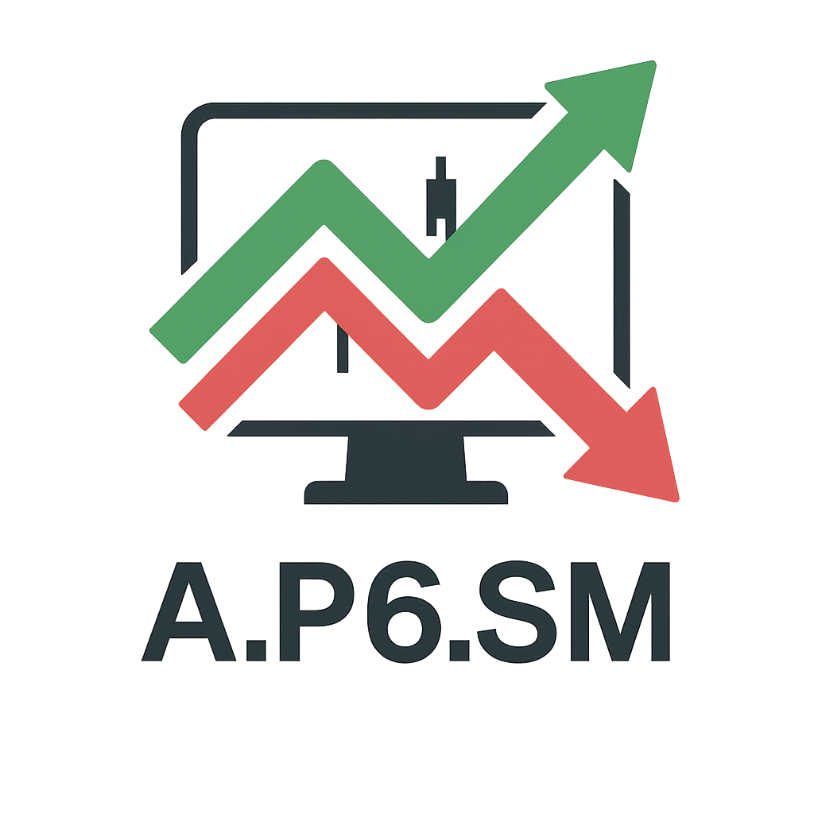
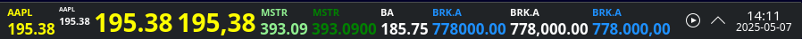
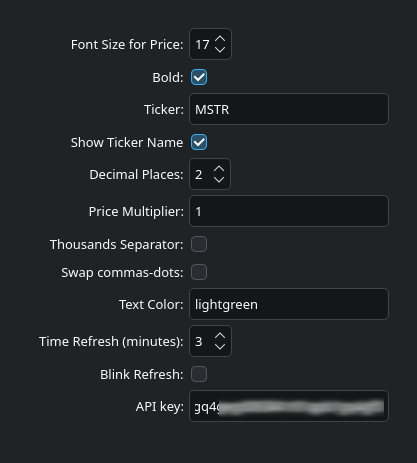

# Another Plasma6 Stock Market (A.P6.SM)

<br><br><br>

__Another Plasma6 Stock Market__ is a Plasma 6 (KDE) applet to display real-time stock prices for U.S. companies in KDE toolbar.

This program was initially based on [Another Plasma6 Coin 2.3](https://github.com/bitcoin-crazy/another-plasma6-coin/). The Another Plasma 6 Coin was initially based on [Plasma Coin 1.0.2](https://store.kde.org/p/2242677/), written by [zayronXIO](https://store.kde.org/u/zayronXIO).

I am an anonymous programmer and I developed this applet for my personal utilization. Feel free to send pull requests.

> [!NOTE]
> This applet is available at [KDE Store](https://www.pling.com/p/2287105).

## How this applet works

A.P6.SM gets prices from [Finnhub.io API](https://finnhub.io/). A free API key is required and must be set in the configurations.

This applet displays stock prices in the toolbar and includes the following features:

* Price updates every x minutes, where x is a number between 1 and 60.
* Retry after 1 minute if the last update fails.
* Immediate price update when clicking on it.
* Support for decimal places.
* Option to display only the price, or include the ticker.
* Option to apply colors to prices.
* Option to use a customizable thousands separator.
* Option to apply a price multiplier.
* The `ERR` (Error) message is shown when an invalid ticker is selected or another error occurs.

## How to install

### Automatic install

The best way to install this applet is via widget manager from KDE.

1. Right-Click over the toolbar and select `Add or Manage Widgets`.
2. Select `Get New` > `Download New Plasma Widgets` > `Another Plasma6 Stock Market`.
3. Click Install button.
4. Right-Click again over the toolbar and select `Add or Manage Widgets`.
5. Select `Another Plasma6 Stock Market` and drag it to the toolbar.
6. Right-Click over the applet in toolbar and select `Configure Another Plasma6 Stock Market`.

### Importing the tarball

Another way to install __Another Plasma6 Stock Market__ is to make it importing the tarball.

1. Download the final tarball `Another.Plasma6.Stock.Market-<version>.tar.xz`
2. Right-Click over the toolbar and select `Add or Manage Widgets`.
3. Select `Get New` > `Install Widget From Local File`.
4. Select the downloaded tarball.
5. Click `Add or Manage Widgets`.
6. Select `Another Plasma6 Stock Market` and drag it to the toolbar.
7. Right-Click over the applet in toolbar and select `Configure Another Plasma6 Stock Market`.

### Manual install

Another way to install __Another Plasma6 Stock Market__ is to make it manually.

1. Copy the directory `Another.Plasma6.Stock.Market` to `~/.local/share/plasma/plasmoids/`
2. Run `$ kquitapp6 plasmashell && kstart plasmashell` or restart KDE.
3. Right-Click over the toolbar and select `Add or Manage Widgets`.
4. Select `Another Plasma6 Stock Market` and drag it to the toolbar.
5. Right-Click over the applet in toolbar and select `Configure Another Plasma6 Stock Market`.

## Options (configuration)

<br><br><br>

There are some options in `Configuration` window.

* `Font Size for Price` will determine the size of the price. The name of the ticker will be shown above the price and its size will be 70% of the price size.
* `Bold` is for price and stock name.
* `Ticker` is a text box used to enter the ticker symbol of the stock to be displayed (e.g.: MSTR, AAPL, AMZN, GE, SPY).
* `Show Ticker Name` displays the ticker name above the current price, if enabled.
* `Decimal Places` is for fractional numbers. The default is to show 2 decimal places.
* `Price Multiplier` allows the user to add an integer or a fractional number to multiply the current price. Up to 4 decimal places can be used. An asterisk will be placed near of the ticker name to symbolize the use of this feature. E.g. MSTR*. See more details below in the section _When to use Price Multiplier?_
* `Thousands Separator` add commas to separate the thousands in the price.
* `Swap commas-dots` swaps commas for dots and vice-versa to match usage in each country. E.g., from 1,000.23 to 1.000,23
* `Text Color` allows the user to choose a color for the price. If empty, the default theme color will be used. It is possible to use a color name (like `yellow`, `yellowgreen`) or a hex color code (like `#00ff00` or `#00FF00`). The character "`#`" is mandatory for hex colors. There is a color name table available [here](https://doc.qt.io/qt-6/qml-color.html#svg-color-reference). To choose a hex color, use the KColorChooser program, available on KDE Plasma 6.
* `Time Refresh` sets the time in minutes to auto-refresh the price. This is a value between 1 and 60.
* `Blink Refresh` defines if the price will blink when refreshing (automatically or via click).
* `API key` is a field used to enter your personal API key obtained for __free__ from [Finnhub.io](https://finnhub.io/).

## When to use Price Multiplier?

The Price Multiplier is a feature that allows you to multiply the current price by an integer or fractional number. You can use up to four decimal places, such as 1.3125. An asterisk will appear next to the ticker name to indicate that this feature is in use. For example: MSTR*.

This feature is useful in two scenarios:

* Suppose you live in _Narnia_, where the official currency is _NAR_. If _1 USDT = 2.33 NAR_, you can select MSTR ticker and apply a multiplier of 2.33 to display the price in _NAR_.

* Suppose you own 1.234 MSTR. You can use 1.234 as the multiplier to see the total value in USD or another currency.

## Getting a ticker list

It is possible to get a ticker list using the  `curl` command.

  ```
  $ curl -s "https://finnhub.io/api/v1/stock/symbol?exchange=US&token=YOUR-API-KEY" | tr ',' '\n' | egrep '"symbol"'| cut -d'"' -f4
  ```

It is possible to make tests against the Finnhub.io API using the `curl` command. See an example for MSTR:

  ```
  $ curl -s "https://finnhub.io/api/v1/quote?symbol=MSTR&token=YOUR-API-KEY" | jq '.c'
  ```

## Ticker name size (hacking)

The size of the ticker names is 70% (0.7) of the price size. This can be changed at `~/.local/share/plasma/plasmoids/Another.Plasma6.Stock.Market/contents/ui/CompactRepresentation.qml`. Search for `0.7`.
